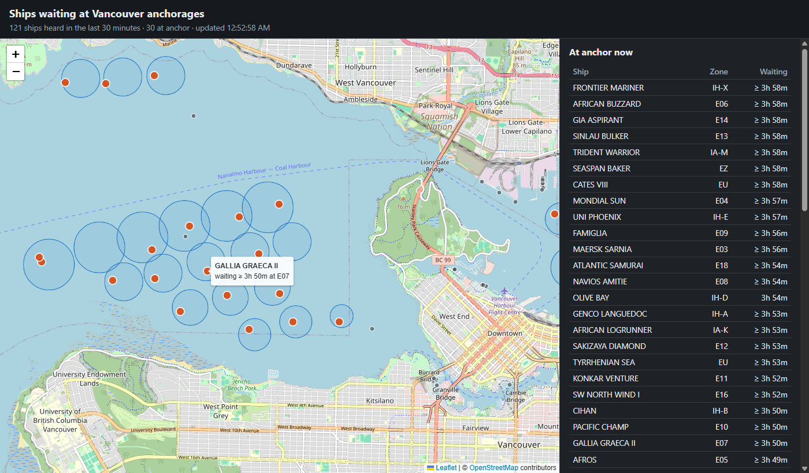

# Borderline

[](https://github.com/macklin-tsang/Borderline/actions/workflows/ci.yml)

Live ship tracking for the Port of Vancouver that answers one question: **how long do ships wait at anchor before they get a berth?**

It reads live vessel positions from [AISStream](https://aisstream.io), uses PostGIS to detect when a ship settles at one of the port's anchorages in English Bay, the Inner Harbour or Indian Arm, records each stay, and shows live positions and dwell statistics on a map.



## What it does

- **Ingests** ship positions over one long-lived WebSocket connection, reconnecting with backoff if it drops or goes silent.
- **Detects** when a ship stops inside an anchorage zone and when it leaves, and stores each stay as a *visit* with an arrival and departure time.
- **Measures** dwell time: ships waiting now, the longest current wait, and the average and median wait of completed visits, per anchorage.
- **Shows** all of it on a map page that refreshes every 10 seconds, with a read-only JSON API behind it.

Runs locally with Docker Compose. There is also a set of Kubernetes manifests for a local k3d cluster, to demonstrate health probes.

## How it works

```
AISStream (wss, one connection, binary frames of JSON)
   |  subscription sent within 3 s; reconnect with backoff + jitter; silence watchdog
   v
AisStreamClient --> PositionReport.parse()    drops "not available" values (lat 91, lon 181, speed 102.3)
                         |
                         v
               AnchorageTracker.handle()      one message at a time, in one transaction
                 1. save the ship's latest position
                 2. which anchorage zones contain it?   (PostGIS, distances in metres)
                 3. open or close a row in anchorage_visits
               @Scheduled closeStaleVisits()  every 10 minutes
                         |
                         v
                  PostgreSQL + PostGIS        anchorages, vessels, anchorage_visits
                         |
                         v
ApiController    GET /api/anchorages   /api/vessels   /api/stats?days=30
                         |
                         v
static/index.html + app.js + style.css        Leaflet map, polls the API
```

Spring Boot serves the page itself, so the page and the API share one origin: no CORS configuration and no separate web server.

### How a visit is detected

All thresholds are constants at the top of [`AnchorageTracker.java`](src/main/java/com/borderline/AnchorageTracker.java).

| Rule | Value | Why |
|---|---|---|
| Ship is "in" an anchorage | within the zone's radius + 150 m, measured in metres on the earth's surface (`geography`) | A swinging ship drifts around its anchor; real ships sat up to 62 m beyond the published radius. The map draws this exact distance. |
| New arrival | in a zone and speed < 0.5 knots; the nearest zone wins | Speed is measured. The crew-set "at anchor" status is often out of date. |
| Departure | speed > 2.0 knots, or the ship left that visit's own zone | The gap between 0.5 and 2.0 knots changes nothing (hysteresis), so a ship swinging at anchor does not flip between arrived and departed. |
| Speed unknown | change nothing | An unknown speed does not mean the ship is moving. |
| Stale visit | no report for 6 hours: close it at the last time we heard from the ship, **only while our own feed is healthy** (positions arriving with no gap over 5 minutes, for at least 15 minutes) | Anchored ships report every few minutes. The guard stops our own outage, or a sleeping laptop, from closing every visit. |
| Start unseen | a visit is marked `seen_arriving = false` if the ship was first seen already anchored, or we last heard from it over 30 minutes earlier | We do not know when that wait began, so the dwell statistics skip it. The page shows "≥ 3h" for these. |
| Timestamps | the time we received the message | A few seconds do not matter for waits measured in days. |

Anchorage positions come from the Vancouver Fraser Port Authority's *Port Information Guide* (August 2026, pp. 185–187): 32 anchorages, copied as printed and converted in SQL ([`V2__anchorages.sql`](src/main/resources/db/migration/V2__anchorages.sql)). The guide gives no swing radius, only the maximum vessel length per anchorage, so that length is used as the radius. It is a first estimate.

## API

Read-only. No login: the data is public broadcast data and there is no user-owned data to protect.

| Endpoint | Returns |
|---|---|
| `GET /api/anchorages` | the 32 anchorages: id, name, area, position, radius and detection reach in metres |
| `GET /api/vessels` | ships heard in the last 30 minutes, each with its anchorage and "anchored since" if at anchor |
| `GET /api/stats?days=30` | per anchorage: ships waiting now, longest wait, completed visits, average and median dwell hours (window 1–365 days) |

Errors use the standard `application/problem+json` format (RFC 9457) and never include a stack trace:

```
GET /api/stats?days=0
400  {"detail":"days must be between 1 and 365","status":400,"title":"Bad Request", ...}
```

## Run it

You need Docker, and a free AISStream API key (sign in with GitHub at [aisstream.io](https://aisstream.io)).

```bash
cp .env.example .env              # then set DB_PASSWORD and AISSTREAM_API_KEY in .env
docker compose up --build -d      # PostGIS + the app
docker compose logs -f app        # watch it connect and detect anchored ships
```

Open <http://localhost:8080>. Both ports are bound to `127.0.0.1` only. Stop with `docker compose down`; the data stays in a Docker volume.

Dwell statistics need time: waits last hours to days, so the median and average fill in as ships leave. The "ships waiting now" figures work immediately. Data is collected only while the stack is running.

### Tests

```bash
./mvnw -B verify        # 41 tests; needs Docker (the integration tests start a real PostGIS container)
```

Unit tests cover the message parser. Integration tests run against real PostGIS rather than mocks: the detection rules, the API's SQL (with known visits and exact expected medians), and the health endpoints. GitHub Actions runs the same command on every push.

### Local Kubernetes (optional)

The manifests in [`k8s/`](k8s) run the app and database on a local [k3d](https://k3d.io) cluster, to show liveness, readiness and startup probes. Compose stays the main way to run it.

```bash
docker build -t borderline:0.1 .
k3d cluster create borderline
k3d image import borderline:0.1 postgis/postgis:16-3.4 -c borderline
kubectl create secret generic borderline-secrets --from-env-file=.env
kubectl apply -f k8s/
kubectl port-forward svc/borderline 8081:8080      # http://localhost:8081
```

The app pod usually restarts once or twice at first: it starts before the database is ready, and Kubernetes retries until it is.

| Probe | Endpoint | Meaning | If it fails |
|---|---|---|---|
| startup | `/actuator/health/liveness` | has it finished starting (JVM and migrations)? | liveness checks wait, up to 2 minutes |
| liveness | `/actuator/health/liveness` | is the process stuck beyond repair? | container restarted |
| readiness | `/actuator/health/readiness` | can it serve (database reachable)? | removed from the Service, **not** restarted |

Liveness deliberately ignores the database and the feed: restarting the app cannot fix either, so checking them would only cause restart loops. The Deployment uses `replicas: 1` with `strategy: Recreate`, because the tracker must be the only consumer of the feed: a rolling update would briefly run two.

## Design choices

| Choice | Why |
|---|---|
| Spring `JdbcClient` and plain SQL, not JPA | The interesting work is SQL (`ST_DWithin`, `percentile_cont`, `ON CONFLICT`); JPA would only add a layer on top of native queries. Every query is readable in the code. |
| PostGIS `geography` | Distances in metres on the curved earth; `geometry` would measure in degrees. |
| Flyway migrations | Versioned, repeatable schema. The anchorage data ships as a migration too. |
| A partial unique index on open visits | The database itself guarantees at most one open visit per ship. |
| One message at a time (`request(1)` backpressure) | No locks needed. |
| Median as well as average | One ship waiting 100 hours moves an average a lot and a median barely. |
| Plain JavaScript + Leaflet, polling | No build step; ships report every few seconds to minutes, so a 10-second poll looks live without a socket to manage. |
| No login | Public, read-only data. The first write endpoint would add Spring Security. |

### Security

- The AISStream key stays on the server (the service does not allow browser connections) and is never committed: `.env` is git-ignored and excluded from the Docker image.
- All SQL uses bound parameters; the one numeric input (`days`) is range-checked.
- Ship names are untrusted radio text. The page only ever builds DOM text nodes, never HTML from a string, and a test fails the build if `app.js` uses `innerHTML` or similar. A Content-Security-Policy blocks inline scripts as a second layer, and the Leaflet CDN files are pinned with integrity hashes.
- Only the `health` Actuator endpoint is exposed, and a test checks that `env`, `heapdump` and the others return 404.
- The container runs as a non-root user; the database port is bound to localhost.

## Limitations

- **Tugs and work boats count.** Any vessel sitting still inside a zone becomes a visit, including tugs and workboats, so counts and averages are somewhat inflated. Filtering by AIS ship type is the obvious fix.
- **The zone radius is an estimate.** It is derived from the maximum vessel length, not a published swing radius.
- **Coverage.** Only the 32 anchorages in English Bay, the Inner Harbour and Indian Arm. Ships sent to the Southern Gulf Islands anchorages are not seen.
- **A move between two anchorages counts as two visits.**
- **AISStream is a free beta service** with no uptime guarantee and no replay, so gaps are possible. The stale-visit guard and the reconnect logic exist for this.
- **One instance only**, by design: the detection logic assumes it is the only consumer of the feed.

## Project layout

```
src/main/java/com/borderline/
  BorderlineApplication.java   starts Spring Boot, enables scheduling
  AisStreamClient.java         the WebSocket: connect, subscribe, buffer frames, reconnect, watchdog
  PositionReport.java          one position, parsed and validated from AISStream JSON
  AnchorageTracker.java        arrival, departure and stale-visit rules (SQL via JdbcClient)
  ApiController.java           the three GET endpoints
src/main/resources/
  application.yml
  db/migration/                V1 schema, V2 the 32 anchorages
  static/                      index.html, app.js, style.css (the map page)
src/test/                      unit tests and integration tests (Testcontainers)
k8s/                           local Kubernetes manifests (database and app)
Dockerfile, docker-compose.yml, .github/workflows/ci.yml
```

## Data and credits

- Ship positions: [AISStream](https://aisstream.io) (AIS data is public broadcast data).
- Anchorage positions: Vancouver Fraser Port Authority, *Port Information Guide* (August 2026).
- Map: [OpenStreetMap](https://www.openstreetmap.org/copyright) contributors, drawn with [Leaflet](https://leafletjs.com).
